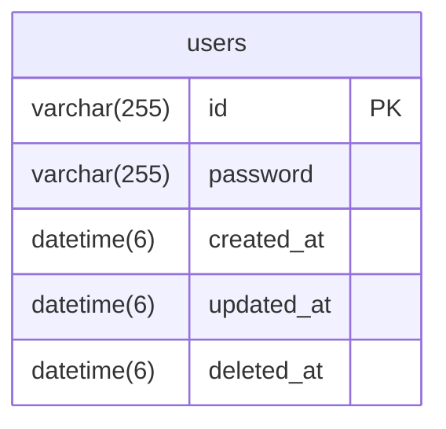

# ER図

# テーブル

## users
**ユーザーテーブル**
| type | name | key | nullable | comment |
| --- | --- | --- | --- | --- |
| varchar(255) | id | PK | | ID |
| varchar(255) | password | | | パスワード |
| datetime(6) | created_at | | | 作成日 |
| datetime(6) | updated_at | | | 更新日 |
| datetime(6) | deleted_at | | TRUE | 削除日 |
