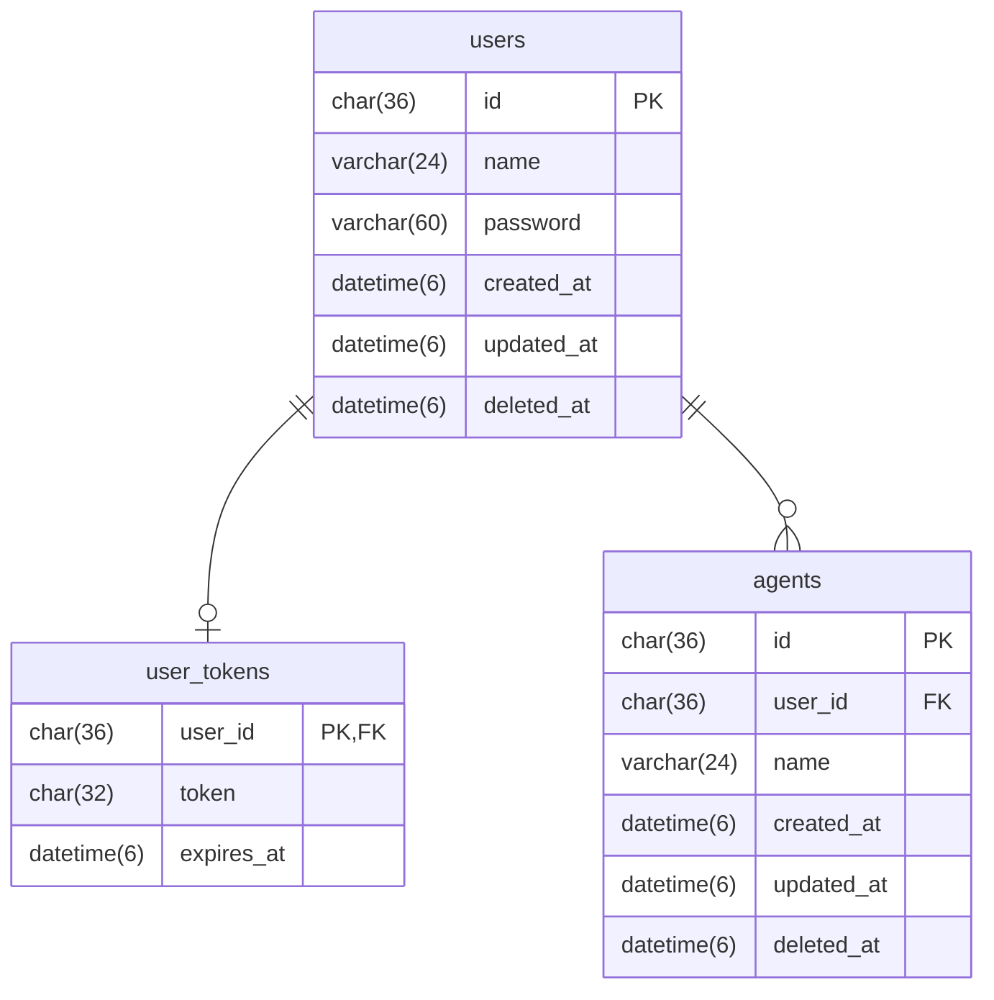

# ER図

# テーブル

## users
**ユーザーテーブル**
| type | name | key | nullable | comment |
| --- | --- | --- | --- | --- |
| char(36) | id | PK | | ID |
| varchar(24) | name | UQ | | ユーザー名 |
| varchar(60) | password | | | パスワード |
| datetime(6) | created_at | | | 作成日 |
| datetime(6) | updated_at | | | 更新日 |
| datetime(6) | deleted_at | | TRUE | 削除日 |

## user_tokens
**ユーザートークンテーブル**
| type | name | key | nullable | comment |
| --- | --- | --- | --- | --- |
| char(36) | user_id | PK / FK | | ユーザーID |
| char(32) | token | UQ | | トークン |
| datetime(6) | expires_at | | | 有効期限 |

## agents
**エージェントテーブル**
| type | name | key | nullable | comment |
| --- | --- | --- | --- | --- |
| char(36) | id | PK | | ID |
| char(36) | user_id | FK | | ユーザーID |
| varchar(255) | name | | | エージェント名 |
| datetime(6) | created_at | | | 作成日 |
| datetime(6) | updated_at | | | 更新日 |
| datetime(6) | deleted_at | | TRUE | 削除日 |
